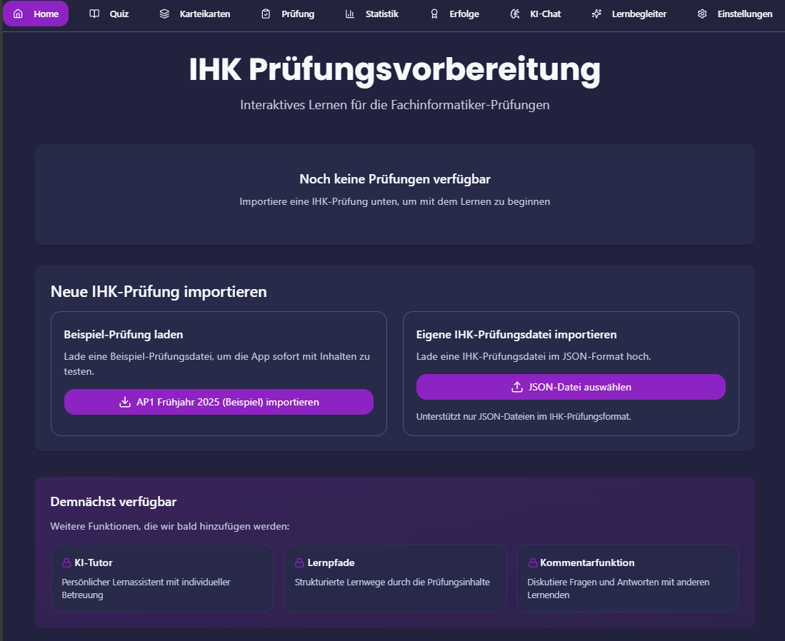

# IHK Prüfungs-Trainer

Eine interaktive Lernanwendung zur Vorbereitung auf die IHK-Prüfung für Fachinformatiker Anwendungsentwicklung.

## Preview



## Features

- **Quiz-System**: Multiple-Choice und offene Fragen mit KI-gestützter Bewertung
- **Level-System**: Gamifiziertes Lernen mit verschiedenen Schwierigkeitsstufen
- **Fortschrittsverfolgung**: Detaillierte Statistiken zu deinem Lernfortschritt
- **KI-Integration**: Intelligente Lernhilfen und Feedback durch Google Gemini API
- **Benutzerverwaltung**: Persönliche Profile mit Fortschrittsspeicherung

## Technologie-Stack

- **Frontend**: React 18, TypeScript, TailwindCSS, ShadcnUI
- **Backend**: Express.js, TypeScript
- **Datenbank**: PostgreSQL mit Drizzle ORM
- **KI**: Google Gemini API
- **Router**: TanStack Router
- **State Management**: React Query
- **Styling**: Tailwind mit class-variance-authority

## Installation & Start

```bash
# Installation der Abhängigkeiten
npm install

# Entwicklungsserver starten
npm run dev

# Produktions-Build erstellen
npm run build

# Produktionsserver starten
npm run start
```

## Umgebungsvariablen einrichten

Kopiere die Datei `.env.example` zu `.env` im Hauptverzeichnis und trage die folgenden Werte ein:

```
GEMINI_API_KEY=dein_api_schlüssel_hier
DATABASE_URL=deine_datenbank_url_hier
```

### API-Schlüssel für Google Gemini

1. Besuche die [Google AI Studio](https://makersuite.google.com/app/apikey)
2. Erstelle einen API-Schlüssel (du benötigst ein Google-Konto)
3. Trage den API-Schlüssel in die `.env`-Datei ein

### Datenbank einrichten

Die Anwendung verwendet PostgreSQL als Datenbank. Nach dem Einrichten der Verbindung:

```bash
# Schema aktualisieren
npm run db:push
```

## Projektstruktur

```
├── client/          # Frontend-Code
│   ├── src/         # React-Komponenten und -Hooks
│   └── index.html   # HTML-Einstiegspunkt
├── server/          # Backend-API und -Services
│   ├── services/    # Geschäftslogik
│   ├── index.ts     # Server-Einstiegspunkt
│   └── routes.ts    # API-Routen
├── shared/          # Gemeinsame Typen und Schemas
│   └── schema.ts    # Datenbankschema mit Drizzle ORM
└── attached_assets/ # Prüfungsbeispiele und Ressourcen
```

## Nächste Entwicklungsschritte

1. Offlinefähigkeit mit IndexedDB
2. Mobile App mit Capacitor
3. Erweiterung der Fragetypen
4. Prüfungssimulator mit Echtzeit-Bedingungen
5. Community-Features und Fragen-Sharing

## Lizenz

MIT
